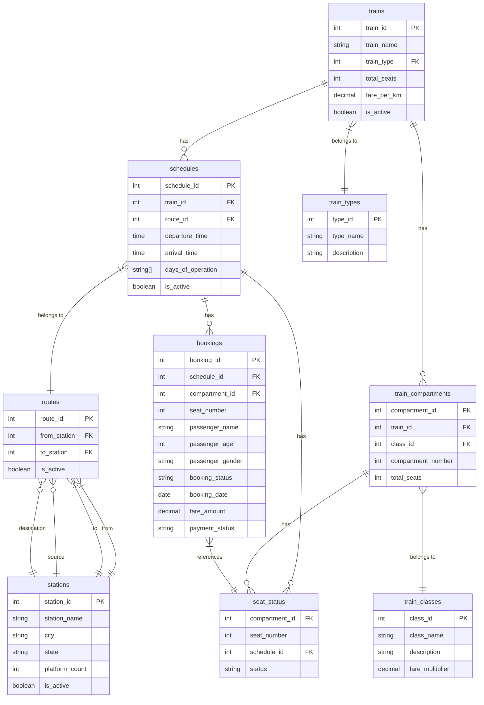

# Railway Management System Database Schema

## Entity Relationship Diagram

## Table Descriptions

### Trains

- Stores information about all trains in the system
- Each train belongs to a specific type (e.g., Express, Superfast)
- Contains basic train information like name, total seats, and fare per kilometer

### Train Types

- Defines different categories of trains
- Contains type name and description
- Used to categorize trains (e.g., Express, Superfast, etc.)

### Train Compartments

- Represents individual compartments in each train
- Links to train classes for fare calculation
- Contains compartment number and total seats

### Train Classes

- Defines different classes of travel (e.g., First Class, Second Class)
- Contains fare multiplier for price calculation
- Includes class description and name

### Stations

- Stores information about all railway stations
- Contains location details (city, state)
- Includes platform count and active status

### Routes

- Defines paths between stations
- Links source and destination stations
- Used to create train schedules

### Schedules

- Contains train timings and routes
- Includes departure and arrival times
- Stores days of operation
- Links trains to specific routes

### Seat Status

- Tracks seat availability for each schedule
- Contains current status of each seat
- Used for booking management

### Bookings

- Stores passenger booking information
- Links to schedules and seats
- Contains passenger details and payment status

## Key Features

1. Multi-class train support
2. Flexible scheduling system
3. Seat availability tracking
4. Route management
5. Station management
6. Booking system with passenger details
7. Fare calculation based on distance and class
